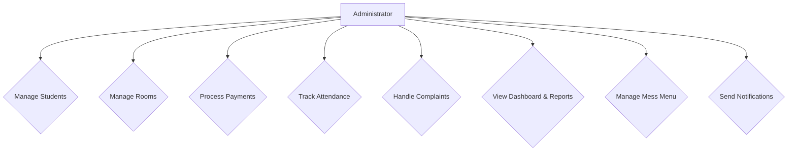

</div>

### **Abstract**
The Hostel Management System is a comprehensive desktop application designed to automate the administrative tasks of a student housing facility. Developed using Java and JavaFX, it provides a centralized platform for efficient management. The system's core functionalities include student registration, room allocation, financial tracking with online payment integration (Stripe), attendance monitoring, and complaint management. Built on an MVC architecture with a local SQLite database, it offers administrators a powerful dashboard with analytics and reporting capabilities. The primary aim is to replace manual processes, reduce administrative workload, and improve data accuracy and accessibility for hostel managers, ultimately enhancing operational efficiency.

**Keywords:** Hostel Management, JavaFX, Student Administration, Desktop Application.

---

### **1. Introduction / Background**
Managing a student hostel involves numerous daily administrative tasks, from tracking resident information and finances to handling maintenance and communication. Traditional paper-based or spreadsheet methods are often inefficient, prone to errors, and lack the centralization required for effective management. This project aims to solve these challenges by providing a dedicated software solution.

### **2. Problem Statement**
Hostel administrators lack an integrated and efficient system to manage all aspects of student housing, leading to wasted time, data inconsistencies, and difficulty in tracking key operational metrics.

### **3. Objectives**
*   To develop a centralized system for managing student records, room allocations, and check-in/out processes.
*   To implement a secure financial module for tracking fees and processing online payments.
*   To digitize daily operations like attendance, visitor logs, and complaint management.
*   To provide an administrative dashboard with reporting and analytics features for data-driven decision-making.
*   To enhance communication between administrators and residents through notification and broadcast features.

### **4. Scope & Limitations**
*   **Scope:** The system covers student management, room allocation, payments, attendance, complaints, and reporting for a single hostel entity.
*   **Scope:** It provides role-based access for administrators.
*   **Limitation:** This is a desktop application and is not accessible over the web.
*   **Limitation:** The system is designed for a single user (administrator) to be logged in at one time.
*   **Limitation:** It does not support the management of multiple hostel branches.

### **5. Use Case Diagram**
This diagram illustrates the primary interactions an administrator has with the system.

*[Image of Use Case Diagram]*



---

### **6. Technology Stack**
*   **Programming Language:** Java 11+
*   **UI Framework:** JavaFX
*   **Build & Dependency Tool:** Apache Maven
*   **Database:** SQLite
*   **IDE:** IntelliJ IDEA / VS Code

### **7. System Architecture**
The application follows the **Model-View-Controller (MVC)** design pattern to ensure a clean separation of concerns.
*   **Model:** Represents the data and business logic. Consists of classes like `Student`, `Room`, `Payment`, and Data Access Objects (DAOs) that handle database interactions.
*   **View:** The user interface, defined using FXML files. It displays data to the user and captures user input.
*   **Controller:** Acts as an intermediary between the Model and the View, handling user input and updating the View and Model accordingly.

**Architectural Flow:**
`[View (FXML)] <--> [Controller] <--> [DAO/Services] <--> [Model (Java Objects)] <--> [Database (SQLite)]`

### **8. Data Model**
The database schema is designed around the core entities of the system.
*   **Key Tables:** `students`, `rooms`, `payments`, `attendance`, `complaints`, `users`, `visitors`, `mess_menu`.
*   **Inputs:** User-provided data via FXML forms (e.g., new student details, payment information).
*   **Outputs:** Data displayed in tables (e.g., student lists), reports (e.g., payment summaries), and dashboard analytics.

---

### **9. Step-by-Step Worked Procedure**
This section explains the typical workflow for an administrator using the system.

#### **Step 1: Login**
The application starts with a secure login screen to ensure only authorized users can access the system.

*[Image of Login Screen]*

#### **Step 2: Main Dashboard**
After logging in, the user is presented with the main dashboard, which provides an at-a-glance overview of key metrics like room occupancy, pending complaints, and recent payments. The navigation panel on the left provides access to all modules.

*[Image of Main Dashboard]*

#### **Step 3: Managing Students**
To add a new student, the administrator navigates to the "Student Management" section and clicks "Add Student". This opens a form to enter the student's details.

*[Image of Add Student Form]*

#### **Step 4: Database Connectivity**
The application connects to a local SQLite database file named `hostel.db`. The connection logic is managed by the `DatabaseManager.java` class, which uses a JDBC driver to establish and manage the connection.

**Connection Setup Snippet (from `DatabaseManager.java`):**
```java
// Conceptual code for establishing connection
private static final String DATABASE_URL = "jdbc:sqlite:hostel.db";
public static Connection getConnection() throws SQLException {
    return DriverManager.getConnection(DATABASE_URL);
}
```
*[Image of DatabaseManager.java code snippet]*

#### **Step 5: SQL Operations**
Data is retrieved and manipulated using SQL commands executed via Data Access Objects (DAOs). For example, the `StudentDAO` class contains methods like `addStudent(Student student)` which executes an `INSERT` statement.

**Example SQL Command (from `StudentDAO`):**
```sql
INSERT INTO students (name, email, phone, address) VALUES (?, ?, ?, ?);
```
This command is executed programmatically to add a new student record to the database.

*[Image of SQL command execution or relevant DAO code]*
